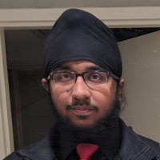

# Welcome to my Markdown Portfolio

My name is [Uday Kalra](https://www.linkedin.com/in/udaykalra), and I study Computer Science at University of California, San Diego. Click [here](#life-goals) for my Life Goals.

As the great George Clinton once professed
>Everybody's got a little light under the sun.



## Life Goals
- [x] Finish my Lab 1 for CSE 110
- [ ] Be a pretty neat guy.
- [ ] Maintain neatness. 

## Languages
- Java
- C++
- C
- Python
- HTML/CSS
- JS

## Some Highlighted Code:
```
System.out.println("What's poppin'");
```
## Employment

I have previously worked for **Google** as a STEP Intern, and have accepted an offer to work there in Summer 2021 as a Software Engineering(*SWE*) Intern. A copy of my resume is available [here](resume.pdf).